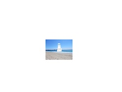

## Welcome to Ice Castle Story

### This is Suitecase. 

**Carmel Ocean Story**

_I have a  friend who took a trip to Carmel with his family.  He told me the story below. 
There was low tide and went swimming in the ocean. I bumped into a wall._

_So I surfaced to see what it was. It was a giant ice castle. I went back to tell my family what I saw. By the time they came to see, the ice castle had vanished._
_Then I again went down in to the ocean and saw the ice castle. My family came with me and we went inside the ice castle. It turned out that there was a giant block of ice._

_There were ten rooms. We went into the second room. I found out there was a secret passage to the tenth room._ 

_I was curious and went inside the passage. The tenth room was high on the ice castle. There were two windows._ 

_There were two water slides one into the beach and other into the ocean._ 

_We went down in slide and claimed up and went on the other slide to the beach._

_There an other tunnel that lead to the other side of the wall and I saw coral reef._

_There was a telescope in one of the rooms. Through the telescope we saw dolphin swimming in the ocean._

_There were weathered glasses pieces.  It was nice to look._

_We had a good time diving. Kamala Fox didn't come with me. We came to the place we were staying._

This story is dedicated to my family and kamala the mewing fox

_Thank you for visiting my page_
